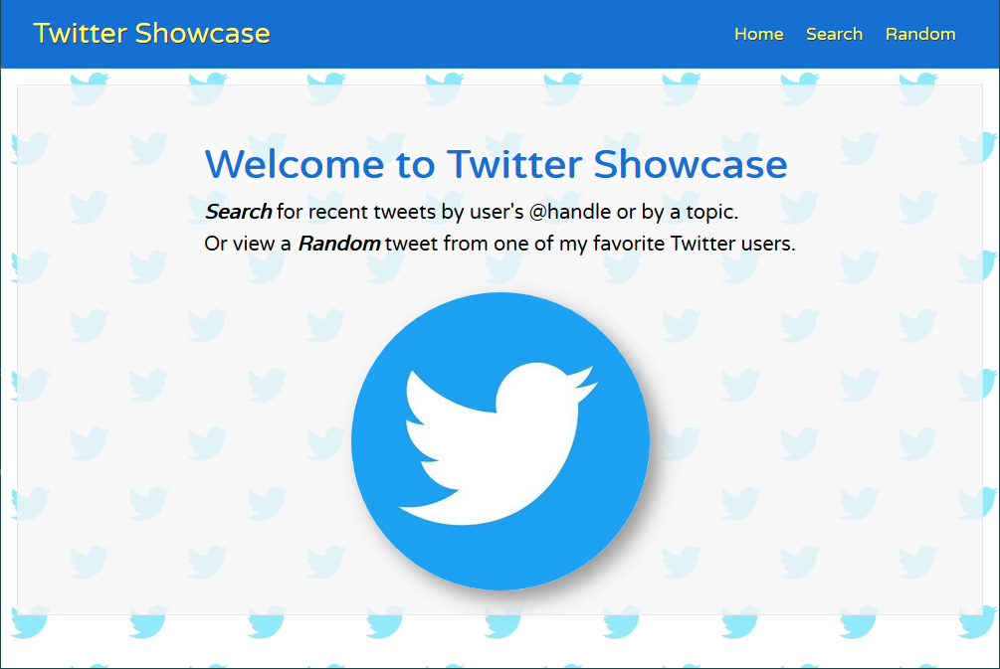

# Twitter Showcase

_A website to showcase Tweets using React and Node._

View live on Heroku <a href="https://twitter-showcase.herokuapp.com/" target="_blank">HERE</a>.

## Summary
Twitter Showcase is a single page application (SPA) that allows the user to search Twitter for tweets by topic or from a specific user. The user can also view a random tweet from several preselected accounts. The primary purpose of this project is to serve as a learning tool to familiarize myself with APIs. In addition, this project has helped me create foundational skills in React and Express.

&nbsp;&nbsp;
&nbsp;&nbsp;
&nbsp;&nbsp;
&nbsp;&nbsp;
&nbsp;&nbsp;
&nbsp;&nbsp;

### Technical
- Front End (JavaScript)
  - React (main SPA)
  - Axios (HTTP requests)
- Back End (Node)
  - Express (Serving static site, internal API endpoints)
  - Axios (HTTP requests)
- Hosts
  - Heroku

### Prerequisites

- To run Twitter Showcase, you need to sign up for a [Twitter developer account](https://developer.twitter.com) and obtain a [bearer token](https://developer.twitter.com/en/docs/basics/authentication/guides/bearer-tokens) in order to communicate with the Twitter API.
- Once a bearer token is acquired, create an .env file in the root directory of twitter-showcase.
- In the .env file, add the line: TWITTER_TOKEN="`<bearer token>`" (replacing `<bearer token>` with the your own.)

You need to have node/npm installed on your machine to run the app locally. To install node, go to https://nodejs.org/

### Install

- From the root directory, run: `npm install`
- Install the devDependencies: `npm i -D nodemon concurrently`
- cd into /client and run: `npm install`

### Resources Used
- <a href="https://www.udemy.com/modern-react-front-to-back/" target="_blank">Udemy - React Front To Back 2019 by  Brad Traversy</a>
- <a href="https://scrimba.com/g/glearnreact" target="_blank">Scrimba - Learn React for free</a>
- <a href="https://developer.twitter.com/en/docs.html" target="_blank">Twitter API Documentation</a>
- <a href="https://www.npmjs.com/package/axios" target="_blank">Axios project page</a>